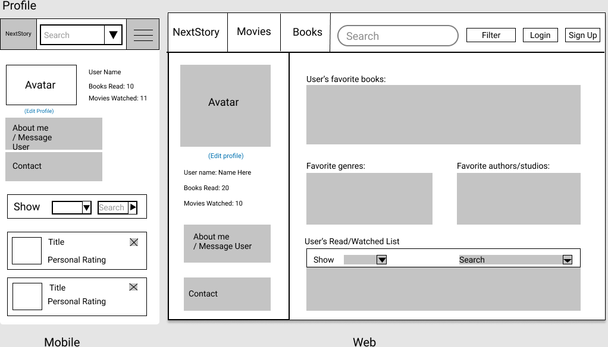

# NextStory
## Final Project Report:
### App description:
A website that allows users to search books and movies, get recommendations, and add them to personal lists.
Users can also add reviews and ratings and add our app specific tags. 

### Clear statement of goals:
- 3-5 minimal requirements (will definitely complete)
  1. Users should be able to register for, log in to & log out of an account and have/be able to update a profile - DONE
  1. Users should be able to search & filter books & movies of interest (search/explore page) - DONE
  1. Users should be able to see a Home page with recommendations - DONE
  1. Each book/movie should have a media page that displays more details about it - DONE
  1. Set up a database - DONE

- 3-7 "standard" requirements (will most likely complete)
  1. Allow users to add and remove story tags from a movie or book - DONE
  1. The website should be able to fetch its book/movie data via external API endpoints - DONE
  1. Allow users to add a review & ratings (out of 5 starts) for a book/movie - DONE
  1. Users should be able to add a book or movie to a personal 'Watch later' list - DONE

- 2-3 stretch requirements (plan to complete 1!)
  1. Add Google login and sign up options - DONE
  1. Users should be able to see information of ‘friends’ on the app - NOT DONE
  
### Description on how tech from Units 1-5 are used in the project
	1. HTML/CSS/Javascript
	- We used CSS to style React components and used JavaScript (and TypeScript) to provide functionalities and to allow the React frontend and the Express backend to send data back and forth.
    - In terms of best practices, we made sure to use buttons when we needed buttons instead of divs with onClick functionality, and we also used TypeScript for stricter data types and maintainability
	
	2. React, Redux, and the “Front End”
	- We stuck to Redux state management structures
    - We used Axios with react middleware support to perform HTTP requests
    - We extensively used Hooks (such as `useState` and `useEffect`) for seamless data mounting and updating in function components

	3. NoSQL with MongoDB
	- We used MongoDB to store tags, review/rating, and user profile data
    - In terms of best practices, we used Mongoose to maintain a more solid data structure, broke up larger data objects into multiple documents in a collection instead of keeping them as one large MongoDB document, and made sure to encrypt all sensitive data in our database

	4. NodeJS and other “Back Ends”
	- Used Express as our service side and re-architected to embed client/frontend React app inside the Express backend 
    - Configure to run both frontend and backend at the same time
    - Services are clearly defined, there are no overlapping functions, and no coupling/dependency between classes

	5. Release Engineering
	- We used a Procfile and restructured our app to work with Heroku deployment.
    - Considering the scale of our project, we stuck to using a monorepo, and we kept a constant list of bugs and polish issues for QA that would be fixed before our deployments.
	
### Above and Beyond functionality:
    - We used 2 different 3rd party APIs and integrated them to work concurrently in our app. We used the TMDB API for the movies, and the Google Books API for books. As they both had different structures for querying their databases, we had to apply different techniques to get them to produce similar data to our frontend. For example, movie genres and book genres can both be searched by clicking a genre button from our frontend (this button is the same for both movies and books on the frontend), but the way in which the data is fetched from TMDB and Google Books for genres was very different, and we structured out backend code to reflect this. 
    - We used Mongoose to structure our data stored in MongoDB in order to keep our data consistent and more maintainable in the future. 
    - We also signed up our app in the Google developer console so that Google login/signup would work, and integrated this into the signup/login process along with non-Google login/sign up that utilized password encryption instead.

### Description of Next Steps: 
    - Keeping media data (blurbs, titles, genres, authors/directors, images) in our own database in the future would decrease our calls to their third party apis as well as make it easier/faster for us to search for specific things (for example, searching the third party movie database by director requires two separate api calls).
    - The incomplete stretch goal of being able to see ‘friend’ info on the app (such as their reviews, ratings, favorited media, etc.) would be a great future addition, as it would create a sense of community on the app and may contribute to keeping users using the app.
    - Allow the explore page to prioritize search results that are related to books or movies a user has already watched/favorited, as well as their favorite genres

### List of contributions:
##### May i9y9a:
##### Warren q6p0b:
##### Michelle s5n0b:
##### David q8j0b:

End of Final Project Report
------------------------------------------------------------------------------------
------------------------------------------------------------------------------------
------------------------------------------------------------------------------------
------------------------------------------------------------------------------------
------------------------------------------------------------------------------------
## High Level Project Description:
- A website that allows users to search books and movies, get recommendations, and add them to personal lists.
- Users can also add reviews and ratings and add our app specific tags. 

## Project Description: 
Write 3-5 sentences on your project topic. (try to address all points below)
- The project is for anyone who wants to get good recommendations for their 
next book or movie, and who wants a robust way to filter stories using tags and genres. 
It will store user data such as profile data, favorite books/movies, favorite genres, 
and personal ratings. It will also store reviews for books/movies. Using this data, users 
will be able to view their favorite books and ratings, as well as get personalized recommendations 
through them, and update their profiles. Additional functionality might include finding theaters 
for movies, seeing ‘friend’ information, or add books/movies to a ‘Watch later’ list.

## Project task requirements:
- 3-5 minimal requirements (will definitely complete)
  1. Users should be able to register for, log in to & log out of an account and have/be able to update a profile
  1. Users should be able to search & filter books & movies of interest (search/explore page)
  1. Users should be able to see a Home page with recommendations
  1. Each book/movie should have a media page that displays more details about it
  1. Set up a database

- 3-7 "standard" requirements (will most likely complete)
  1. Allow users to add and remove story tags from a movie or book
  1. The website should be able to fetch its book/movie data via external API endpoints
  1. Allow users to add a review & ratings (out of 5 starts) for a book/movie
  1. Users should be able to add a book or movie to a personal 'Watch later' list

- 2-3 stretch requirements (plan to complete 1!)
  1. Add Google login and sign up options
  1. Users should be able to see information of ‘friends’ on the app

## Pick 2 of your minimal requirements and break each of them down into ~2-5 smaller tasks!
1. Profile pages
  - Form for adding & updating alias, name, etc.
  - Change password
  - Have Read/Watched list
  - Show a user's Favourite section for books & Movies
  - A display of the total number of books/movies read/watched

2. Home page
  - Login/Registration button
  - Trending books or movies
  - Search bar for books
  - Button to see your selected books
  - Profile pic
  
  
## Prototypes
#### Home page:

#### Profile page:

