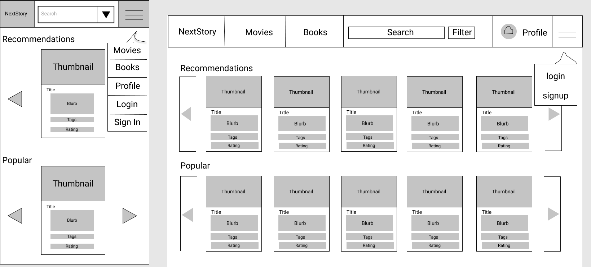

# NextStory
## Project Description: 
Write 3-5 sentences on your project topic. (try to address all points below)
- The project is for anyone who wants to get good recommendations for their 
next book or movie, and who wants a robust way to filter stories using tags and genres. 
It will store user data such as profile data, favorite books/movies, favorite genres, 
and personal ratings. It will also store reviews for books/movies. Using this data, users 
will be able to view their favorite books and ratings, as well as get personalized recommendations 
through them, and update their profiles. Additional functionality might include finding theaters 
for movies, seeing ‘friend’ information, or add books/movies to a ‘Watch later’ list.

## Project task requirements:
- 3-5 minimal requirements (will definitely complete)
  1. Users should be able to register for, log in to & log out of a regular user/admin account and have/be able to update a profile
  1. Users should be able to search & filter books & movies of interest
  1. Users should be able to see a Home page (see 2-5 smaller requirements)
  1. Each book/movie should have a media page that displays more details about it
  1. Set up a database

- 3-7 "standard" requirements (will most likely complete)
  1. Admins should be able to add new book/movie manually
  1. The website should be able to update its book/movie list via external API endpoints
  1. Allow users to add a review & ratings (out of 5 starts) for a book/movie
  1. Users should be able to add a book or movie to a personal 'Watch later' list

- 2-3 stretch requirements (plan to complete 1!)
  1. Locate a theater showing chosen movies
  1. Users should be able to see information of ‘friends’ on the app

## Pick 2 of your minimal requirements and break each of them down into ~2-5 smaller tasks!
1. Profile pages
  - Form for adding & updating alias, name, etc.
  - Change password
  - Have Read/Watched list
  - Show a user's Favourite section for books & Movies
  - A display of the total number of books/movies read/watched

2. Home page
  - Login/Registration button
  - Trending books or movies
  - Search bar for books
  - Button to see your selected books
  - Profile pic
  
  
## Prototypes
#### Home page:

#### Profile page:

## Cycle 1 Scrum Updates:
#### May i9y9a: 
What did you work on this past iteration?
 - As a team we decided on what our project would and our project requirements.

What were any major issues/challenges you ran into?
 - Figma was a little tricky to use at first when making the prototypes.

What do you plan to work on for this coming iteration?
 - With the team, figure out what styling library to use and start building the main components and pages, and select a movie and book database api
 - Individually, start building some components, and maybe hook up a database api
